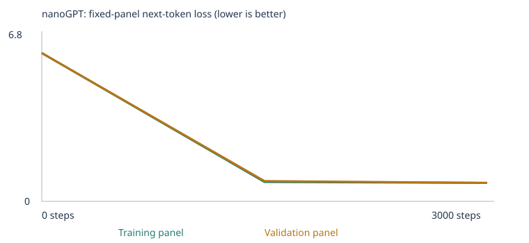
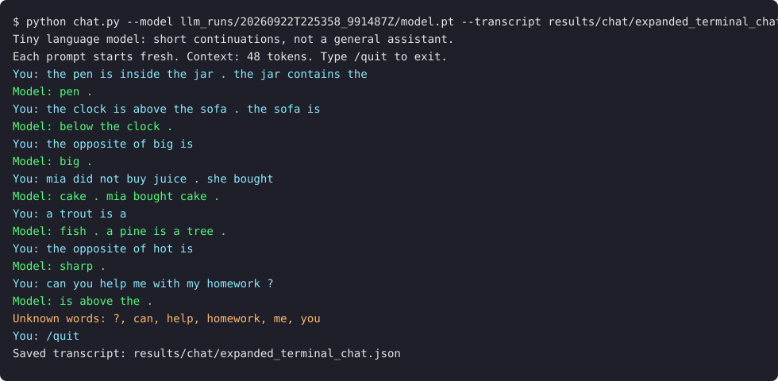

# My Custom LLM Experiment: tiny nanoGPT, starter corpus vs. expanded corpus

Class 4, Fall 26 · From Zero to AI Agents

I trained Karpathy's nanoGPT transformer from scratch with word tokens. It has 2 blocks,
4 heads, 64-number embeddings and a 48-token context, and it runs on a CPU with no API
and no pretrained weights. I ran two experiments with identical settings:

1. **Starter**: the supplied classroom corpus, 3,000 steps, learning rate 0.001.
2. **Expanded**: the same corpus plus teaching text I wrote for four extension-eval
   categories (opposites, negation, spatial relations, categories/analogies), with the same settings.

Each experiment ran the fixed 48-case language-eval suite before and after training.
The starter instructions I began from are kept in [README_STARTER.md](README_STARTER.md).

| | Starter | Expanded (final) |
|---|---|---|
| Executed notebook | [custom_llm_starter.ipynb](custom_llm_starter.ipynb) | [custom_llm_expanded.ipynb](custom_llm_expanded.ipynb) |
| Run folder (all evidence) | [llm_runs/20260922T224924_640441Z](llm_runs/20260922T224924_640441Z) | [llm_runs/20260922T225358_991487Z](llm_runs/20260922T225358_991487Z) |
| Results ZIP | [.zip](llm_runs/20260922T224924_640441Z.zip) | [.zip](llm_runs/20260922T225358_991487Z.zip) |
| Evals after training | **20 / 48** | **28 / 48** |

An earlier version of the expanded corpus (v1) is also kept:
[experiments/custom_llm_expanded_v1.ipynb](experiments/custom_llm_expanded_v1.ipynb) and
[llm_runs/20260922T225202_918677Z](llm_runs/20260922T225202_918677Z). The section on
[Why there is a v1 and a v2](#why-there-is-a-v1-and-a-v2) explains why.

---

## 1. My choices and prediction

| Setting | Value | Reason |
|---|---|---|
| Corpus | `classroom` (run 1); `classroom` + `corpus/extension/*.md` (run 2) | Start from the controlled baseline, then change only the data |
| Training steps | 3,000 | The recommended starting budget. At 32 passages per batch that is about 96k passages, around 23 passes over the starter training set |
| Learning rate | 0.001 (AdamW, 100-step warmup, cosine decay to 10%) | The standard value for a model this small. If it were much larger, updates could overshoot and the loss could jump or diverge. If it were much smaller, the random weights would barely move in 3,000 steps |
| Seed | 42 (unchanged) | Keeps the split, panels and sampling comparable |

**Prediction (written before running, also in each notebook's section 1):** the untrained loss would be
close to ln(vocabulary size), and samples would be word salad. After training, both panel losses
would fall well below 1.0 and stay close together, because validation sentences use the
same templates. I expected most starter-pattern evals to pass and none of the 24 extension evals
to pass, since their words are missing from the starter vocabulary. I also expected
**customer** to end up near client, buyer and shopper.

**What actually happened:** the prediction held. Untrained loss was 4.926, against ln(136) = 4.913.
Final loss was 0.678 on the training panel and 0.706 on the validation panel. Starter patterns
scored 16/16, and all 24 extension cases were unscorable. The nearest neighbors of customer
became shopper (0.978), client (0.977) and buyer (0.977). One thing I did not predict is
that the loss stopped improving at about 0.68 after step 1,500 (see section 4).

## 2. Corpus and data

### Starter corpus
The notebook generates synthetic sentences about business, finance, food, transport, software,
health and education (see `classroom_corpus()` in the notebook). Before the split and vocabulary
were built, 160 generated passages containing an exact eval prefix were removed
([eval_separation.json](llm_runs/20260922T224924_640441Z/eval_separation.json)).

### My extension corpus (`corpus/extension/`)
I wrote the extension text myself with [make_extension_corpus.py](make_extension_corpus.py).
It is fully synthetic, so I have permission to share it. There are no PDFs, so no PDF
extraction warnings were possible. I checked the notebook's printed file previews and the
[corpus_manifest.json](llm_runs/20260922T225358_991487Z/corpus_manifest.json).

| File | Passages | Why I chose this category / what it teaches |
|---|---:|---|
| [opposites.md](corpus/extension/opposites.md) | 744 | Starter has no antonym vocabulary. Teaches the frame "the opposite of X is Y" (plus "X and Y are opposites" and contrast sentences) with 28 word pairs in both directions |
| [negation.md](corpus/extension/negation.md) | 930 | Teaches "X is not A. it is B. X is B" and "N did not buy A. she bought B. N bought B": the correct word is the one after the correction, not the negated one |
| [spatial_relations.md](corpus/extension/spatial_relations.md) | 1,016 | Teaches inverse relations: inside ↔ contains, above ↔ below, left of ↔ right of, with many object pairs |
| [categories_and_analogies.md](corpus/extension/categories_and_analogies.md) | 890 | Teaches "a M is a K" for 9 kinds (bird, fish, fruit, vegetable, tool…), two-fact analogies and "a young animal grows into an adult animal" |

I chose these four because each is a single, repeatable sentence pattern that a
0.13M-parameter model can plausibly learn from many examples. I skipped the other four
categories. Grammar, reference, sequence and everyday knowledge each need many unrelated
facts or word forms, so I judged them less likely to work at this scale.

**Separation rules.** These are stricter than the notebook's exact-prefix check:
- No eval prompt appears anywhere. The generator checks every line and the whole file with the
  course's own `matching_cases`, and the notebook's `reject_eval_leakage` checks it again on import.
- The **exact pairs the tests ask about are never taught in the tested relation**. For example,
  hot/cold, empty/full and noisy/quiet never appear as opposites. They appear only in neutral
  sentences ("the soup was hot today .") so the words are in the vocabulary. The same rule covers
  book-in-bag, lamp-above-desk, ball-left-of-box, box red/blue, tea/milk, door, robin/salmon,
  puppy/dog, kitten/cat and carrot/apple. The model therefore has to transfer a pattern to a new
  pair and cannot recall a memorized answer.
- No names used in the eval suite (ava, maya, leo, …) appear in my corpus.
- Limit: this check does not catch paraphrases. Using other colors or objects in the same
  frame as a test is intended pattern teaching, not a copy of a test item.

**A tokenizer detail I had to work around.** The notebook's `chunk_text` splits a passage
after every period followed by whitespace. So "the cup is not red . it is blue ." would
become separate one-sentence passages, and the model would never see the two-sentence
patterns the negation and spatial tests use. I write multi-sentence examples without the
space (`not red.it is blue.`). The word tokenizer turns this into exactly the same tokens
(`red`, `.`, `it`), and the lines stay together as one passage.

### Split and vocabulary

| | Starter | Expanded (v2) |
|---|---:|---:|
| Unique passages | 4,592 | 8,172 (3,580 new) |
| Train / validation passages | 4,132 / 460 | 7,354 / 818 |
| Vocabulary (incl. UNK/BOS/EOS) | 136 | 485 |
| Training / held-out unknown-token rate | 0.00% / 0.00% | 0.00% / 0.00% |
| Parameters | 111,872 | 134,208 |
| Vocabulary report | [link](llm_runs/20260922T224924_640441Z/vocabulary_report.json) | [link](llm_runs/20260922T225358_991487Z/vocabulary_report.json) |

Both vocabularies are under the 509-type cap, so no word was dropped to UNK. The 90/10
split is by deduplicated passage. The held-out passages come from the **same templates**, so
validation loss tests new combinations inside known patterns. It does not test new
domains or writing styles.

## 3. My runs

| | Starter | Expanded v2 |
|---|---|---|
| Completed steps | 3,000 of 3,000 (not interrupted) | 3,000 of 3,000 (not interrupted) |
| Training time | 15.1 s | 22.6 s |
| Hardware | Apple Silicon Mac CPU (macOS 26.6.2 arm64), PyTorch 2.14.0, Python 3.13 | same |
| Config / summary | [config.json](llm_runs/20260922T224924_640441Z/config.json) · [training_summary.json](llm_runs/20260922T224924_640441Z/training_summary.json) · [training.csv](llm_runs/20260922T224924_640441Z/training.csv) | [config.json](llm_runs/20260922T225358_991487Z/config.json) · [training_summary.json](llm_runs/20260922T225358_991487Z/training_summary.json) · [training.csv](llm_runs/20260922T225358_991487Z/training.csv) |

I executed the notebooks locally with Jupyter (`jupyter nbconvert --execute`) instead of in Colab.
The code is identical. [prepare_experiment.py](prepare_experiment.py) changes only three
things in a copy of `custom_llm.ipynb`: my prediction text, the experiment label, and the
chat cell. The chat cell loops over several prompts so that one Run All records them all.
Model, training, eval and saving code are unchanged.

## 4. Evidence: loss, samples, tokens, gradients

### Loss (fixed panels of 20 training and 20 validation passages)

| Step | Starter train | Starter validation | Expanded train | Expanded validation |
|---:|---:|---:|---:|---:|
| 0 | 4.9263 | 4.9275 | 6.1928 | 6.1908 |
| 1500 | 0.6821 | 0.7182 | 0.8099 | 0.8459 |
| 3000 | 0.6783 | 0.7061 | 0.7717 | 0.7702 |

Sources: [starter history.json](llm_runs/20260922T224924_640441Z/history.json),
[expanded history.json](llm_runs/20260922T225358_991487Z/history.json).
Each value is the mean next-token loss over all non-padding targets in the panel.

| Starter | Expanded |
|---|---|
|  |  |

- The step-0 loss equals a uniform guess: ln(136) = 4.91 and ln(485) = 6.18.
- Validation loss stays close to training loss in both runs (a gap of 0.04 or less), so I saw no overfitting.
- The loss does **not** go toward 0. Much of the remaining ~0.7 is irreducible, because after
  "we learned about the" any of 4 adjectives and dozens of nouns are valid, so no model can
  be certain. That is why little changed between step 1,500 and step 3,000.
- The two runs' losses are **not comparable** because they use different vocabularies and data.

### Samples: untrained → halfway → final (same generation settings)

Starter ([step_0000](llm_runs/20260922T224924_640441Z/samples/step_0000.txt) ·
[step_1500](llm_runs/20260922T224924_640441Z/samples/step_1500.txt) ·
[step_3000](llm_runs/20260922T224924_640441Z/samples/step_3000.txt)):

| Step | First two samples |
|---|---|
| 0 | `pear professor bond doctor course harvest team physician journey checking buyer …` / `kitchen purchase journey product question discussion journey service . nurse local` |
| 1500 | `our school has a question about the new educator and lesson .` / `a review of risk helped us understand the different deposit .` |
| 3000 | `our school has a question about the new educator and lesson .` / `a review of risk helped us understand the different deposit .` |

At step 0 the output is random vocabulary. By step 1,500 the samples are valid template
sentences whose nouns match their domain (educator + lesson, risk + deposit). The first two
samples at 1,500 and 3,000 are identical. The sampling seed is fixed and the model barely
changed, which matches the flat loss.

Expanded ([step_0000](llm_runs/20260922T225358_991487Z/samples/step_0000.txt) ·
[step_1500](llm_runs/20260922T225358_991487Z/samples/step_1500.txt) ·
[step_3000](llm_runs/20260922T225358_991487Z/samples/step_3000.txt)): the halfway
samples include `my teacher said the opposite of fast is far .`. The frame is right but
the pair is wrong: "far" belongs to near/far. So the model learned *where* an opposite
goes before it learned *which* word.

### One word → token → ID → vector (starter run)
From [tokenization.json](llm_runs/20260922T224924_640441Z/tokenization.json) and
[inspection.json](llm_runs/20260922T224924_640441Z/inspection.json):

- Text `today the school focused on lesson …` → tokens `['today','the','school',…]` → IDs
  `[1(<BOS>), 121, 118, 101, 42, 74, …, 2(<EOS>)]`. The IDs are just row numbers in an alphabetical list.
- The word **customer** is ID **28**, so its embedding is row 28 of the 136 × 64 table.
  - Before training (first 5 of 64): `[-0.0576, -0.0048, 0.0426, 0.0193, 0.0156]`, small random numbers.
  - After training: `[0.0366, -0.0182, 0.1330, 0.1059, 0.0630]`
  - Nearest words by cosine similarity (all 64 dimensions): before training bus 0.21,
    educator 0.20, helped 0.20 (meaningless). After training **shopper 0.978, client 0.977,
    buyer 0.977**. Those words appear in exactly the same sentence slots, so their gradients
    pushed them to nearly the same vector. This shows shared contexts, not an understanding of commerce.
- A *token* is the text unit ("customer"). The *ID* is its row number (28). The *vector* is the
  64 numbers in that row. The *embedding* is that learned row, which training changes and the ID never does.

### One real gradient and parameter update
`first_update` in inspection.json: coordinate 0 of customer's embedding at step 1.

| before | gradient | learning rate (warmup step 1) | after |
|---|---|---|---|
| −0.0575919 | +0.000692587 | 0.00001 | −0.0576019 |

The gradient is positive, which means increasing this number would increase the loss, so the
optimizer moved it **down**. The change is −0.0000100, exactly one learning-rate unit. On
AdamW's first step, momentum divided by the root of the squared-gradient average equals the
sign of the gradient, so the step is −lr × sign(g). Weight decay adds only about +6×10⁻⁹. Repeating
this 3,000 times for all 111,872 numbers is how the loss fell from 4.93 to 0.68.

### Next-token probabilities for the same prefix, `the customer`

| | Top 5 next tokens |
|---|---|
| Before training | customer 0.016 · bus 0.011 · educator 0.010 · us 0.010 · application 0.010 (almost uniform, 1/136 ≈ 0.007) |
| After training | reviewed 0.178 · recommended 0.171 · ordered 0.169 · selected 0.163 · compared 0.160 |

After training, 84% of the probability goes to the 5 verbs that actually follow
"the customer" in the corpus, split nearly evenly because the corpus uses each equally often.

### Attention (block 1, head 1, prefix `<BOS> the customer`)
```
<BOS>     [1.00, 0,    0   ]
the       [0.61, 0.39, 0   ]
customer  [0.49, 0.42, 0.09]
```
Each row is how much one position reads from earlier positions. Everything above the
diagonal is exactly 0 because of the causal mask. A position cannot look at future
tokens, because at generation time those tokens do not exist yet, and seeing them in
training would let the model copy the answer. In the expanded run the same head puts
0.90 of the weight on "customer" itself, so the same head can learn a different job when
the data changes.

### Temperature (same start and sampling seed, no weight changes)
[starter temperature_comparison.json](llm_runs/20260922T224924_640441Z/temperature_comparison.json) ·
[expanded](llm_runs/20260922T225358_991487Z/temperature_comparison.json)

Generation divides the scores by the temperature, applies softmax, and samples one token at a time.

- Starter: T=0.3 changed 2 of 4 sentences (e.g. `investment` instead of `deposit`). T=0.8 and T=1.2
  were **identical**. The trained distributions are so peaked that even T=1.2 did not change
  which token the fixed random draws selected.
- Expanded: T=1.2 produced more varied and less sensible output: `the suitcase contains the shirt .
  the letter is inside the bell .` and `the fawn stood beside the bench .`. A flatter distribution
  gives rare continuations a chance.
- No weights change during sampling. The model file hash is identical before and after
  generation, and the chat cell checks this.

## 5. Fixed language evals (48 cases, unchanged)

Suite: [evals/language_evals.json](evals/language_evals.json) (unchanged, SHA-256 checked by the
notebook) · runner: [run_evals.py](run_evals.py) · full comparison with every case:
[results/eval_comparison.md](results/eval_comparison.md).

**Scoring.** The runner sends only the prompt to the model. The model scores 1 if it gives
the correct word the highest probability among the four choices, and 0 if another choice or
a tie wins. A case is **unscorable** (counted as 0) if any prompt word *or any of the four
choices* is not in the vocabulary. The free continuation is saved separately and is not scored.

| Experiment | Stage | Correct / 48 | Scorable / 48 | Accuracy among scorable | Full results |
|---|---|---|---|---|---|
| Starter corpus | Untrained | 9 | 24 | 37.5% | [summary](llm_runs/20260922T224924_640441Z/language_evals/untrained/eval_summary.json) · [csv](llm_runs/20260922T224924_640441Z/language_evals/untrained/eval_results.csv) · [json](llm_runs/20260922T224924_640441Z/language_evals/untrained/eval_results.json) |
| Starter corpus | Trained | **20** | 24 | 83.3% | [summary](llm_runs/20260922T224924_640441Z/language_evals/final/eval_summary.json) · [csv](llm_runs/20260922T224924_640441Z/language_evals/final/eval_results.csv) · [json](llm_runs/20260922T224924_640441Z/language_evals/final/eval_results.json) |
| Expanded corpus (v2) | Untrained | 9 | 35 | 25.7% | [summary](llm_runs/20260922T225358_991487Z/language_evals/untrained/eval_summary.json) · [csv](llm_runs/20260922T225358_991487Z/language_evals/untrained/eval_results.csv) · [json](llm_runs/20260922T225358_991487Z/language_evals/untrained/eval_results.json) |
| Expanded corpus (v2) | Trained | **28** | 35 | 80.0% | [summary](llm_runs/20260922T225358_991487Z/language_evals/final/eval_summary.json) · [csv](llm_runs/20260922T225358_991487Z/language_evals/final/eval_results.csv) · [json](llm_runs/20260922T225358_991487Z/language_evals/final/eval_results.json) |
| *Expanded v1 (earlier)* | *Untrained / Trained* | *9 / 28* | *29* | *31.0% / 96.6%* | [v1 final](llm_runs/20260922T225202_918677Z/language_evals/final/eval_summary.json) |

The untrained scores (9/48) come from chance. With four choices, random weights give about 25%
of the scorable cases.

### By group and category (correct / scorable / total)

| Category | Starter trained | Expanded v2 trained | What changed |
|---|---|---|---|
| starter domain_context | 8/8/8 | 8/8/8 | — |
| starter domain_place | 8/8/8 | 8/8/8 | — |
| starter_transfer new_wording | 4/8/8 | **7/8/8** | +3 (see below) |
| **opposites** (mine) | 0/0/3 | 0/**3**/3 | vocabulary only, still wrong |
| **negation** (mine) | 0/0/3 | **1/2**/3 | door ✔, box ✘, ava unknown |
| **spatial_relations** (mine) | 0/0/3 | **3/3/3** | all correct |
| **categories_and_analogies** (mine) | 0/0/3 | **1/3**/3 | apple→fruit ✔, salmon ✘, kitten ✘ |
| grammar, reference, sequence, everyday_knowledge | 0/0/12 | 0/0/12 | not taught, still unscorable |

### What the results show

**Starter patterns: 16/16 in both runs.** The reserved prefixes such as "the report about the
surgeon explains the" were never trained on. The model had only seen *other* sentences
pairing surgeon with patient and care.

**New wording (4/8 → 7/8).** In the starter run the model failed 4 transfer prompts, e.g.
"yesterday the school discussed the educator and the", where it picked harvest instead of
student. The probabilities were all near 0 because "discussed the X and the" is not a
starter template for that position. In the expanded run 4 of those became correct but one
that had passed (pear → fruit) failed, a net gain of 3. The probabilities stay very low
(student 0.002, update 0.006). This is fragile. It is **not**
evidence that my extension text taught better transfer, because the v1 run scored 8/8 and v2
scored 7/8 on the same prompts. Differences this small can come from random initialization
and data order.

**Spatial relations: 3/3, the clearest success.**

| Prompt | Choice probabilities | Continuation |
|---|---|---|
| the lamp is above the desk . the desk is | **below 0.994**, above 0.004 | `below the lamp .` |
| the ball is left of the box . the box is to the | **right 0.983**, left 0.015 | `right of the ball .` |
| the book is inside the bag . the bag contains the | **book 0.472** | `on .` |

My corpus never contained lamp/desk or ball/box, so the model applied the inverse-relation
pattern to new objects. The free continuations show this too. For inside/contains the multiple-choice
answer was right, but the continuation "on ." was not. A correct selection and fluent generation are different things.

**Negation: 1 of 2 scorable.** The door case was correct (closed 0.453 vs open 0.045). The box
case was wrong: yellow 0.087, blue 0.084, green 0.055, red 0.052. The model learned that a *color*
comes next but not *which* color to copy. In my data every color follows "the X is" equally
often, so the probability mass is spread over colors, and copying from 8 tokens earlier did not win.
In v1 this case was correct (blue 0.246), so this skill is unstable at this model size.
The ava case stays unscorable because I deliberately did not add the eval's names. Its free
continuation was still `milk .` in v1.

**Opposites: 0/3, a clear failure.** Every probability was below 0.01. For "the opposite of hot is"
the model picked heavy (0.004) over cold (0.001), and its continuation was `young .`. Because I never taught
hot/cold as a pair, this tests whether the model can *infer* an antonym, and it cannot.
It learned the frame (it outputs an adjective) but the pairs are memorized, and nothing links
hot to cold. In chat, "the opposite of big is" (a *taught* pair) produced `big .`. So even
memorized pairs are unreliable, and the model sometimes copies the input word.

**Categories/analogies: 1/3.** apple→fruit was correct (0.85). apple was already a starter
word that appears with fruit and juice. salmon→fish failed (tool 0.028 vs fish 0.002). salmon
appeared only in "swims in cold water / has fins" sentences, and that shared context was not
enough to place it in the "is a fish" slot. v1 got this case right (0.53). kitten→cat failed
(horse 0.012, goat 0.008, cat ≈ 0). My growth examples always paired a baby word with a different
adult word, so the model never saw cat as a growth target. The trained embedding of **fish** is closest to
vehicle, fabric and metal, the other *category* words, not to trout or shark. The model learned
"fish is a word that ends category sentences" rather than what a fish is.

**Coverage versus learning.** Coverage rose from 24 to 35 scorable cases, and that happened in
the *vocabulary* before any training (35 scorable at the untrained stage). Correct answers rose
from 20 to 28. Of the 8 extra, 5 are my extension categories (learned patterns) and 3 are
new-wording cases (probably noise, as explained above). So the gain came from **both**:
vocabulary made cases scorable, and the patterns made some of them correct. More steps on the
starter corpus could never have helped the extension cases, because the words did not exist.

### Why there is a v1 and a v2
My first extension corpus (v1) made only 5 of 24 extension cases scorable, although it taught the
tested *answers*. The reason was the scoring rule: a case needs **all four choices** in the
vocabulary, and I had not included distractors such as heavy, early, loud, round, late,
missing, beside, north and south. v2 adds those words **only in neutral sentences**
("the stone was heavy .", "the town is north of the lake ."), not in the tested relations.
Everything else is identical. Both runs are kept. v1 scored 28/48 with 29 scorable, and v2 scored 28/48
with 35 scorable. v2 is my final result because it measures more of my categories. It did
not score higher: it gained door→closed, above/below and left/right, but lost box→blue and
salmon→fish, which v1 had right. Because I looked at the eval results to design v2, this suite is
a **public development benchmark** for me, not an untouched test.

### Corpus/eval separation
- [starter eval_separation.json](llm_runs/20260922T224924_640441Z/eval_separation.json) and
  [expanded eval_separation.json](llm_runs/20260922T225358_991487Z/eval_separation.json): 160
  generated classroom passages containing starter-test prefixes (lang_01–16) were removed
  **before** splitting and vocabulary building.
- My corpus files passed `reject_eval_leakage` on import, and my generator also checks them with
  the course's matcher. Neither is a semantic check: a paraphrase would not be caught, which
  is why I also excluded the tested word pairs by hand (section 2).
- Eval prompts, answers, results and chat logs live in `evals/`, `llm_runs/` and `results/`,
  never in `corpus/`. The notebook refuses a `CORPUS_FOLDER` that contains `evals/` or the project root.

## 6. Chat interface

The model is a *tiny language model that continues text*, not an assistant. Each prompt starts
fresh with no shared history. Only the last 48 tokens are used, and unknown words become
`<UNK>` and are listed. Chatting never trains the model or adds to the corpus.

**Notebook:** section 10 of each executed notebook runs a list of prompts on the model in memory
and saves `chat_transcript.json`
([starter](llm_runs/20260922T224924_640441Z/chat_transcript.json),
[expanded](llm_runs/20260922T225358_991487Z/chat_transcript.json)).

**Terminal:** [chat.py](chat.py) loads a saved `model.pt` (the network plus its vocabulary):

```bash
pip install -r requirements.txt
```
```bash
python chat.py --model llm_runs/20260922T225358_991487Z/model.pt --transcript results/chat/my_new_chat.json
```

Type a prompt and press Enter. Type `/quit` to exit.

Session with the expanded model (model SHA-256 `f26904a1…`, 3,000 steps). Rendered from the
real terminal output:
[text log](results/chat/expanded_terminal_session.txt) ·
[transcript JSON](results/chat/expanded_terminal_chat.json)



| Prompt | Model reply | Comment |
|---|---|---|
| the pen is inside the jar . the jar contains the | `pen .` | ✔ but this exact pair is in my corpus, so it may be recalled |
| the clock is above the sofa . the sofa is | `below the clock .` | ✔ also a pair from my corpus. The eval's lamp/desk case is the real test of a new pair |
| a trout is a | `fish . a pine is a tree .` | ✔ taught fact, and it continues the two-fact pattern |
| mia did not buy juice . she bought | `cake . mia bought cake .` | the frame is right, but nothing earlier says cake, so it is invented |
| the opposite of big is | `big .` | ✘ copies the input word, although "the opposite of big is small ." is in my corpus word for word |
| can you help me with my homework ? | `is above the .` | ✘ 6 unknown words; this is not an assistant |

The starter model's session ([log](results/chat/starter_terminal_session.txt),
[svg](results/chat/starter_terminal_session.svg)) shows the main limitation. `the opposite of hot is`
gives an **empty reply** because opposite, hot and is are all unknown. The model sees
`<BOS> the <UNK> of <UNK> <UNK>` and ends the passage at once.

## 7. How to rerun everything

```bash
python3 -m venv .venv && .venv/bin/pip install -r requirements.txt numpy
```
```bash
.venv/bin/python make_extension_corpus.py
```
```bash
.venv/bin/python prepare_experiment.py expanded && .venv/bin/jupyter nbconvert --to notebook --execute --inplace custom_llm_expanded.ipynb
```

For the starter experiment, move `corpus/extension/` out of `corpus/` first, then run
`prepare_experiment.py starter`. To open a notebook in Colab, upload it, or open the course
starter from its [Colab link](https://colab.research.google.com/github/pepealonso95/custom-llm/blob/main/custom_llm.ipynb)
and upload `corpus/extension/*.md` into `/content/corpus/extension/`.

Rerun the evals from a saved model without training (outputs are identical to the notebook's):
```bash
python run_evals.py --model llm_runs/20260922T225358_991487Z/model.pt --output results/rerun_evals/expanded_final_again
```
```bash
python run_evals.py --model llm_runs/20260922T225358_991487Z/model_untrained.pt --stage untrained --output results/rerun_evals/expanded_untrained_again
```
My reruns are in [results/rerun_evals](results/rerun_evals): 28/48 and 20/48, matching the notebooks.
To view embeddings, open [embedding-viewer.html](embedding-viewer.html) locally → **Open your checkpoint**
→ choose a run's `checkpoint.json`.

## 8. What I learned

1. **Corpus.** The starter corpus teaches which nouns share contexts in 8 domains and 9 sentence
   templates. It contains no negation, antonyms, space or categories. Holding out 10% of passages
   checks that the model predicts *new combinations* rather than memorizing lines. Because the
   templates are shared, it cannot show generalization to new kinds of text.
2. **Token / ID / vector / embedding.** "customer" is a token. 28 is its arbitrary ID. Row 28 is a
   vector of 64 numbers. That learned row is its embedding, and training moved it next to
   shopper, client and buyer.
3. **Neural network and learning.** The token and position vectors pass through attention and
   GELU feed-forward layers with 111,872 weights. Loss is −log of the probability the model gave
   to the real next word. Backpropagation gives each weight a gradient (e.g. +0.00069), and AdamW
   moves it against the gradient (−0.00001). Over 3,000 steps the loss fell from 4.93 to 0.68.
4. **Attention** mixes information from earlier positions only. The causal mask zeroes all future
   positions. That is how, in "the ball is left of the box . the box is to the", the last position can read "left" from several tokens back and predict "right".
5. **Generation.** The model's scores become probabilities through softmax(scores / T). One token is
   sampled, appended and fed back in, until EOS or 24 tokens. Low T is safer and more repetitive,
   high T is more varied and less correct. Temperature never changes a weight.
6. **Conclusion.** Loss curves and samples supported my prediction: fluent template sentences
   and no overfitting. The evals show what that fluency is worth. The model learns strong
   surface patterns (spatial inverses and domain associations transfer to new objects), but it
   cannot infer relations it never saw for a specific pair (antonyms). It is also unstable on
   copying a word from earlier in the context (negation colors).

## 9. One limitation and my next experiment

**Observed limitation:** the model cannot produce an antonym it was not taught as a pair
(0/3 opposites, all probabilities below 0.01). It even copies the input for a taught pair
(`the opposite of big is` → `big .`). The negation box→blue case also flipped between v1 (correct)
and v2 (wrong), so these results depend on the particular run.

**Next experiment:** to test whether the instability comes from the random seed or from the data,
I would run the expanded v2 corpus with 3 different seeds, with everything else fixed, and report the
mean and spread for each category. I predict spatial relations stays 3/3 in all seeds because its
probabilities are very high (above 0.98). Negation and categories should vary between 0 and 2 out
of 3, which would show those skills are near the edge of what this model learns. A second
option is to make copying the explicit target, with more varied negation and
reference passages where the answer word appears only in the earlier sentence.

## Repository map

| Path | What |
|---|---|
| `custom_llm_starter.ipynb`, `custom_llm_expanded.ipynb` | My executed notebooks (outputs kept) |
| `experiments/custom_llm_expanded_v1.ipynb` | Executed notebook of the first expanded corpus |
| `custom_llm.ipynb`, `custom_llm.py` | Unmodified course starter notebook/script |
| `prepare_experiment.py` | Creates the experiment notebooks from the starter (prediction + chat prompts only) |
| `make_extension_corpus.py`, `corpus/extension/` | My extension teaching corpus and its generator |
| `llm_runs/<run>/` and `.zip` | Complete saved evidence and models for each run |
| `results/eval_comparison.md` | Every eval case across all runs · `summarize_results.py` regenerates it |
| `results/chat/`, `results/rerun_evals/` | Terminal chat evidence and eval reruns from the saved models |
| `evals/`, `run_evals.py`, `chat.py`, `nanogpt_model.py` | Unchanged course eval suite, runner, chat interface, nanoGPT (MIT, [license](NANOGPT_LICENSE)) |
