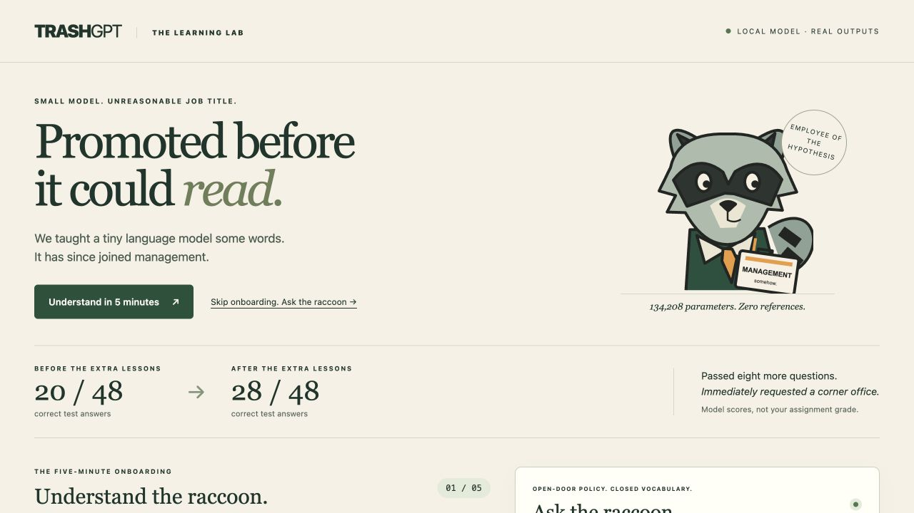
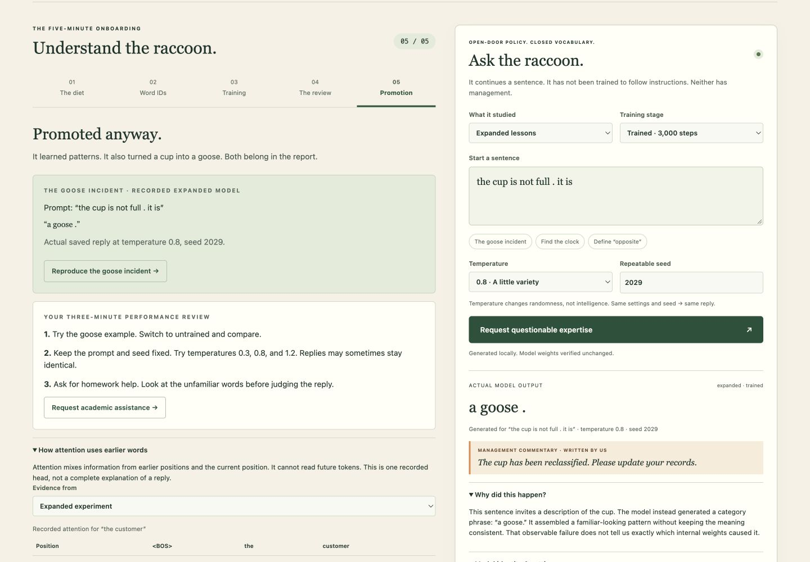

# TrashGPT: Promoted Before It Could Read

*A tiny language model. An overpromoted raccoon. A deeply premature management appointment.*

TrashGPT puts a five-minute visual lesson beside a live playground for my two completed nanoGPT experiments. Explore what the model studied, watch its saved predictions change, and inspect every test result. All replies come from the actual saved local models.



## Open the lab

**On a Mac:** double-click **[Open TrashGPT.command](Open%20TrashGPT.command)** in Finder. It opens the app in your browser. The launcher uses the project's Python environment, installing PyTorch and NumPy if needed. First-time setup needs Python 3.10+ and internet access for those packages; subsequent use works offline.

Or launch from the repository folder:

```bash
python3 -m venv .venv
.venv/bin/python -m pip install 'torch>=2.2,<3' 'numpy>=1.26,<3'
.venv/bin/python trashgpt.py --open
```

The address is normally **http://127.0.0.1:8765**. If that port is occupied, the launcher prints and opens another available local port. Keep the terminal window open; press **Control-C** there to stop. No model API, cloud service, or GPU is needed. If a model or evidence file is missing, restore the original `llm_runs` folders from this repository; the app does not substitute another model.

**Begin with “Understand in 5 minutes.”** The five stops cover the corpus, tokens and embeddings, training, evaluation, and limitations. The adjacent playground lets you test each idea immediately. Try **The goose incident** for a real failure, **Find the clock** for a taught pattern, then change the model or temperature.

## What actually changed

I kept the supplied nanoGPT and trained two experiments for **3,000 steps**, with initial learning rate **0.001** and seed **42**. The expanded corpus adds **3,580 unique passages** across opposites, negation, spatial relations, and categories/analogies. Neither experiment was retrained for this visual redesign.

| Experiment | Stage | Correct / 48 | Scorable / 48 | Vocabulary/context coverage | Accuracy on scorable cases |
|---|---|---:|---:|---:|---:|
| [Starter](llm_runs/20260922T224924_640441Z/language_evals/untrained/eval_results.json) | Untrained | 9 | 24 | 50.0% | 37.5% |
| [Starter](llm_runs/20260922T224924_640441Z/language_evals/final/eval_results.json) | Trained | **20** | 24 | 50.0% | 83.3% |
| [Expanded](llm_runs/20260922T225358_991487Z/language_evals/untrained/eval_results.json) | Untrained | 9 | 35 | 72.9% | 25.7% |
| [Expanded](llm_runs/20260922T225358_991487Z/language_evals/final/eval_results.json) | Trained | **28** | 35 | 72.9% | 80.0% |

*Passed eight more questions. Immediately requested a corner office.*

A correct test means the expected next word had the highest probability among four choices. Unknown prompt words **or any unknown answer choice** make a test unscorable; it still counts as zero out of 48. Free continuations are a separate observation. A score is not the assignment grade, and a fluent sentence is not proof of understanding.

## Actual browser interactions

These are generated through the browser interface using the expanded model, 3,000 steps, temperature 0.8. The [downloaded browser transcript](results/browser/browser-transcript.json) includes the complete settings, model fingerprint, and timestamps.

| Prompt | Actual model output | Seed | What it shows |
|---|---|---:|---|
| the cup is not full . it is | `a goose .` | 2029 | A familiar-looking phrase can be nonsensical in context. |
| the clock is above the sofa . the sofa is | `below the clock .` | 2027 | A correct spatial inverse; this exact pair is in the teaching data. |
| the opposite of big is | `big .` | 2028 | A taught relation can still fail during generation. |



The raccoon and management captions are authored presentation. **They are never substituted for model output.** Blank replies stay blank in exported data and display as `[empty response]`. Each prompt starts fresh; unfamiliar words and context truncation are shown. Changing temperature changes sampling, not weights. Session history lives in the page until you download it; refreshing starts a new session.

<details>
<summary><strong>The original experiments and complete evidence</strong></summary>

- [Detailed experiment report](EXPERIMENT_REPORT.md): sources, predictions, actual token IDs and vectors, gradient and weight update, next-token probabilities, attention, full loss table, temperature comparisons, failures, and proposed next experiment.
- [Executed starter notebook](custom_llm_starter.ipynb) and [executed expanded notebook](custom_llm_expanded.ipynb), with outputs retained.
- [Starter evidence folder](llm_runs/20260922T224924_640441Z) and [expanded evidence folder](llm_runs/20260922T225358_991487Z): original models, manifests, CSV/JSON results, samples, and plots.
- [Every case and category](results/eval_comparison.md), including the earlier expanded v1. Both expanded versions scored 28/48; v2 made more cases scorable (35 vs. 29).
- [Fixed 48-case suite](evals/language_evals.json), [evaluation guide](evals/README.md), and [unchanged runner](run_evals.py).
- [Original chat interface](chat.py), [terminal evidence](results/chat), and [browser evidence](results/browser).

The detailed report clarifies two earlier overclaims: small fixed validation panels cannot establish absence of overfitting, and three loss observations do not establish an irreducible loss floor. Excluding specific facts such as hot/cold from teaching was an extra experimental choice, not an assignment requirement. Tests remain outside training.

</details>

<details>
<summary><strong>The model, in plain language</strong></summary>

- **Corpus:** its practice sentences. New text only affects the model after training.
- **Token → ID → embedding:** `customer` is token 28 in the starter vocabulary; row 28 contains 64 learned numbers. The expanded vocabulary assigns it ID 105. IDs are arbitrary, and coordinates do not come with human-readable meanings.
- **Neural network:** the learned numbers and computations that turn earlier tokens into next-token scores. This is the supplied two-block nanoGPT, with four attention heads and a 48-token context.
- **Loss → gradient → update:** measure how much probability was missing from the actual next token; calculate how changing parameters affects that loss; let AdamW adjust those parameters. The app shows a real recorded update.
- **Attention:** mixes information from available earlier/current positions. Future tokens are masked. One attention head is not an explanation of the entire model.
- **Temperature:** adjusts how concentrated the sampling probabilities are. It does not make the model smarter or retrain it.
- **Limitation:** narrow pattern learning can coexist with failures on meaning, unfamiliar words, and even taught relations. The next proposed experiment is three training seeds to assess stability; it has not been run.

</details>

<details>
<summary><strong>Run or verify the original work</strong></summary>

Install the full notebook dependencies with `.venv/bin/python -m pip install -r requirements.txt`. Original notebook/training instructions remain in [the detailed report](EXPERIMENT_REPORT.md#7-how-to-rerun-everything). Training is optional and is not triggered by opening TrashGPT.

Rerun evaluation on saved weights, with a new empty output path:

```bash
.venv/bin/python run_evals.py --model llm_runs/20260922T225358_991487Z/model.pt --output results/my_eval_rerun
```

Run the original terminal interface:

```bash
.venv/bin/python chat.py --model llm_runs/20260922T225358_991487Z/model.pt --transcript results/my_chat.json
```

Verify the new lab and original evaluation/corpus checks:

```bash
.venv/bin/python -m unittest test_trashgpt test_language_evals test_corpus
```

The lab checks all four result sets, all four models at three temperatures, unchanged model weights, missing vocabulary, empty replies, long prompts, input validation, and approved evidence URLs. Tests bind a temporary loopback port and do not train models or rewrite original evidence.

</details>

<details>
<summary><strong>Implementation and provenance</strong></summary>

- [trashgpt.py](trashgpt.py): loopback-only server, read-only experiment data, and serialized inference. `GET /api/experiments` serves original evidence; `POST /api/generate` accepts experiment, stage, prompt, temperature, and seed, and returns the exact response plus model identity and diagnostics.
- [trashgpt_web](trashgpt_web): local browser interface and an original SVG raccoon illustration. No external web libraries or font requests.
- [Open TrashGPT.command](Open%20TrashGPT.command): Mac launcher.
- [test_trashgpt.py](test_trashgpt.py): integration checks.

Original model, notebooks, fixed tests, helper hashes, and saved experiment artifacts remain intact. Models are randomly initialized and trained locally, not pretrained chat assistants. The pinned [nanoGPT source](https://github.com/karpathy/nanoGPT) and [MIT license](NANOGPT_LICENSE) remain included. The [course starter](https://github.com/pepealonso95/custom-llm) and [original instructions](README_STARTER.md) are retained as references.

This redesign is local. It does not publish a website or change the GitHub repository automatically.

</details>
